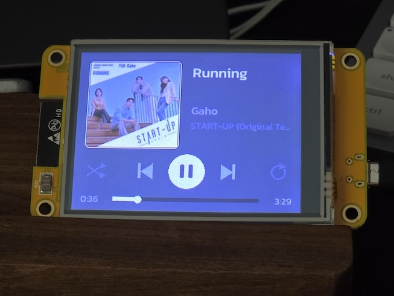

# Spotify CYD — Now Playing Display

🇹🇭 [อ่านภาษาไทย](README.th.md) · 📖 [Setup guide](docs/SETUP.md) · 📘 [User manual](docs/MANUAL.md) · 📝 [Changelog](CHANGELOG.md)

A Spotify Now Playing display for the "Cheap Yellow Display" board
(ESP32-2432S028R): album art, track/artist/album names (Thai supported),
full touch playback controls, and a UI that tints itself to the album art's
dominant color.

<p align="center">
  
  <br>
  <sub>The real thing — the "cheap yellow" board itself, no case needed</sub>
</p>

## Features

- 🎨 **Album art** with Floyd–Steinberg dithering; the whole UI (background,
  buttons, frames) tints itself to the art's dominant color
- 🇹🇭 **Thai text rendering** (OpenFontRender + embedded Kanit subset)
- 🌏 **Japanese/Korean/Chinese titles** via server-side text rendering
  (Noto Sans CJK), with automatic fallback to the embedded font
- 📜 **Marquee scrolling** for titles too long to fit, plus a **tap-to-detail**
  screen showing the full title/artists/album
- 🔀 **Spotify Connect device switching**: long-press to pick where the music
  plays (phone, computer, speakers)
- 🎛️ **Full playback control**: play/pause · previous/next · shuffle ·
  repeat (off/context/track) — five touch zones with state-aware icons
- ⏩ **Tap-to-seek** on the progress bar (locally interpolated, updates
  every second without network traffic)
- 🔊 **Swipe volume**: swipe up/down anywhere for ±10%, with an on-screen
  volume bar
- 🌙 **Ambient-light auto-brightness** via the CYD's onboard light sensor;
  touch a dimmed screen to wake it (first touch never skips a track)
- 🕐 **Clock screen** when nothing is playing; friendly offline screen with
  the server address when the server is unreachable
- 📶 **WiFiManager captive portal** for first-time WiFi + server setup,
  **OTA updates** afterwards — no cable needed
- 🔍 **Debug endpoints**: live screenshot over HTTP, display test pattern,
  light-sensor and touch readouts, 180° flip
- 🐳 **Dockerized companion server** (Flask + spotipy + Pillow) handling
  OAuth, caching, art conversion, and Spotify rate-limit protection

```
Spotify API ── Mac/PC on the LAN (server/) ── plain HTTP ── CYD board (firmware/)
```

A small companion server handles Spotify OAuth and converts album art to raw
RGB565 for the board, so the ESP32 never has to deal with TLS or JPEG
decoding.

## What you need

- **ESP32-2432S028R "Cheap Yellow Display"** board (2.8" ILI9341 + resistive
  touch, ~$5–8) and a USB cable/charger to power it. The 2-USB-port variant
  (ST7789 panel) works too — build with the `cyd2usb` env instead.
- **An always-on computer on the same WiFi/LAN** to run the companion server
  (Mac mini, PC, Raspberry Pi, NAS…) — Python 3.10+ or Docker.
- **A Spotify account** — the display works with any account, but the touch
  controls (play/pause, seek, volume, device switching…) require **Premium**
  plus an active device (a Spotify app playing/paused somewhere).
- **A Spotify Developer app** (free) for the Client ID/Secret — created in
  step 1 below.
- **2.4 GHz WiFi** — the ESP32 cannot see 5 GHz networks.
- **PlatformIO** (`pip install platformio`) for the first flash over USB;
  later updates go over WiFi (OTA).

## First-time setup

### 1. Create a Spotify app

1. Go to https://developer.spotify.com/dashboard → **Create app**
2. Set the **Redirect URI** to `http://127.0.0.1:8888/callback` (must match exactly)
3. Note the Client ID / Client Secret

### 2. Set up the server (on the always-on machine)

```bash
cd server
python3 -m venv .venv && .venv/bin/pip install -r requirements.txt
.venv/bin/python app.py          # first run creates config.json, then stops
# edit config.json: fill in client_id / client_secret
.venv/bin/python auth.py         # one-time Spotify login in your browser
.venv/bin/python app.py          # serves on port 8080
```

Test: play something in Spotify, then `curl http://127.0.0.1:8080/now`

For a permanent install use Docker (always run `auth.py` on the host first —
the container cannot open a browser):

```bash
docker compose up -d --build
# logs: docker logs -f spotify-cyd
```

The container is set to `restart: unless-stopped`; enable Docker Desktop's
start-at-login and it survives reboots. (Alternative: launchd via
`server/com.kritsadas.spotify-cyd.plist` if you'd rather not use Docker.)

### 3. Flash the board

```bash
cd firmware
pio run -t upload                # first time over USB
pio run -e cyd_ota -t upload --upload-port <board-ip>   # later, over WiFi
```

On first boot the board opens an access point named **Spotify-CYD-Setup** —
connect to it, open `192.168.4.1`, pick your WiFi, and set the **Server IP**
(default `192.168.1.195`).

## Using it

- **Control row** (bottom): shuffle · previous · play/pause · next · repeat —
  shuffle/repeat icons light up in the album accent color when active
- **Tap the progress bar** to jump to that position in the track
- **Tap the album art / track info** to see the full title, artists, and album
- **Long-press** anywhere to pick which device plays (Spotify Connect) —
  works from the clock screen too
- **Swipe up/down** anywhere to change volume ±10% (a volume bar appears
  briefly in place of the progress bar)
- **Auto-brightness**: the backlight follows the room's light via the CYD's
  onboard light sensor; touching a dimmed screen wakes it to full brightness
  for 5 minutes (the first touch only wakes — it never skips a track)
- Nothing playing → clock screen (tap thirds: previous / play-pause / next)

Notes: playback commands require **Spotify Premium** and an active device.
Setting the volume is rejected by Spotify on some targets (e.g. an iPhone as
the playback device).

## Endpoints

| Where | Endpoint | What it does |
|---|---|---|
| server | `GET /now` | Current-track JSON incl. `theme565`, `volume`, `shuffle`, `repeat` |
| server | `GET /art/<id>?size=130` | Album art as raw RGB565 big-endian |
| server | `POST /playpause` `/next` `/previous` | Playback commands |
| server | `POST /seek?ms=N` | Jump to position |
| server | `POST /volume?delta=N` (or `?set=N`) | Adjust volume 0–100 |
| server | `POST /shuffle` / `POST /repeat` | Toggle shuffle / cycle repeat mode |
| server | `GET /text?t=&px=` | Text as packed 4-bit grayscale (CJK-capable); `&wrap=W&lines=N` for multi-line |
| server | `GET /devices` | Spotify Connect device list |
| server | `POST /transfer?id=` | Move playback to another device |
| board | `GET /version` | Firmware version (board identity check) |
| board | `GET /screen` | Live screenshot (use `tools/capture.py`) |
| board | `GET /server?h=IP` | Change server IP and reboot |
| board | `GET /test` | 2-minute display test pattern |
| board | `GET /flip` | Rotate the display 180° and reboot |
| board | `GET /ldr` | Light-sensor reading + current backlight duty |
| board | `GET /touch` | Last touch gesture (calibration aid) |
| board | `GET /artbuf` | Dump the on-device art buffer (debug) |

Note: for the 2-USB-port CYD variant (ST7789 panel) build with
`pio run -e cyd2usb -t upload` instead.

## Layout

- `server/` — Flask + spotipy + Pillow (Python)
- `firmware/` — PlatformIO, TFT_eSPI + OpenFontRender (Kanit font embedded in `src/kanit_font.h`)
- `tools/capture.py` — pull a real screenshot from the board: `python3 tools/capture.py <board-ip>`

Fonts: on-board [Kanit](https://github.com/cadsondemak/kanit) (OFL), subset to
**Latin + Thai** (~26 KB), used for the clock/offline screens and as fallback.
Track text is rendered server-side with **Noto Sans** (Thai → Latin → CJK
fallback chain), so Japanese/Korean/Chinese titles display correctly.
